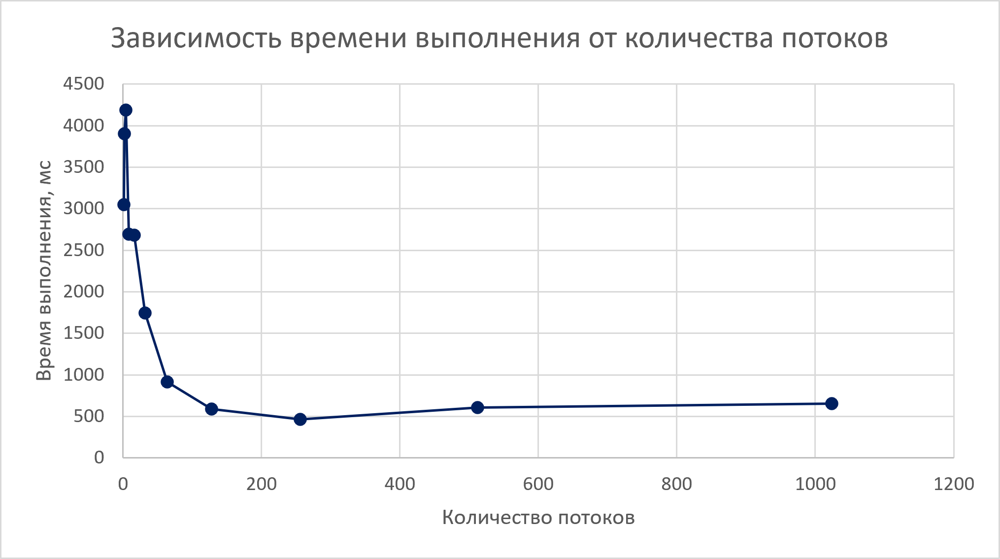

# Зависимость времени выполнения от количества потоков

| Количество потоков | Медианное время, мс |
|-------------------:|--------------------:|
| 1                  | 3049 |
| 2                  | 3901 |
| 4                  | 4187 |
| 8                  | 2691 |
| 16                 | 2684 |
| 32                 | 1745 |
| 64                 | 914 |
| 128                | 591 |
| 256                | 465 |
| 512                | 608 |
| 1024               | 655 |

